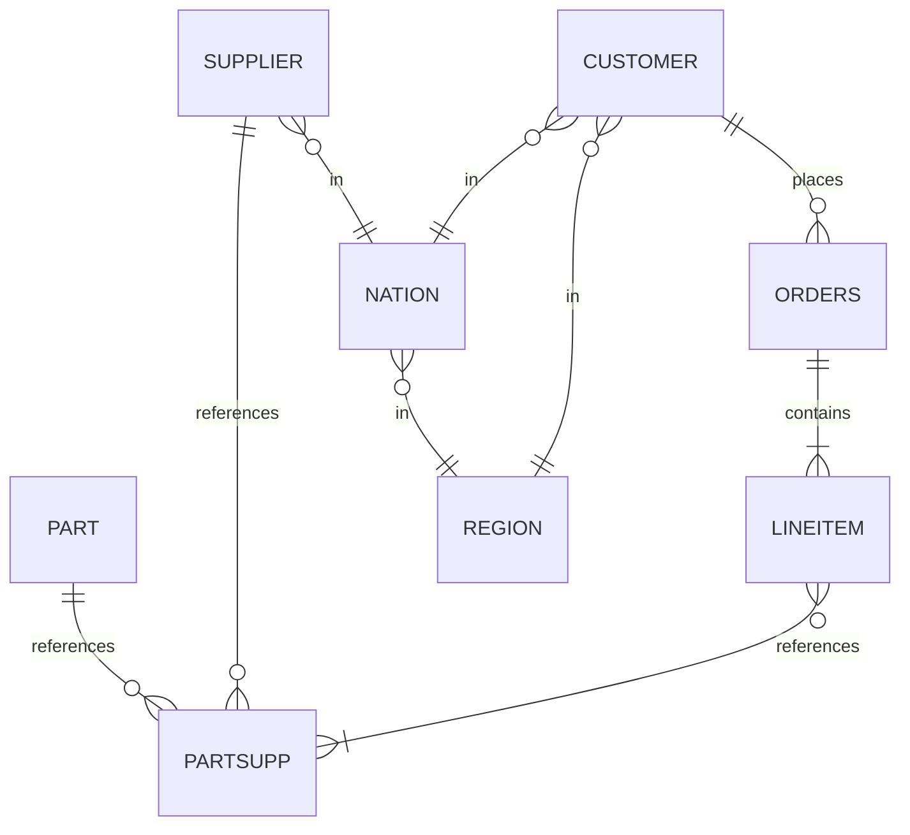
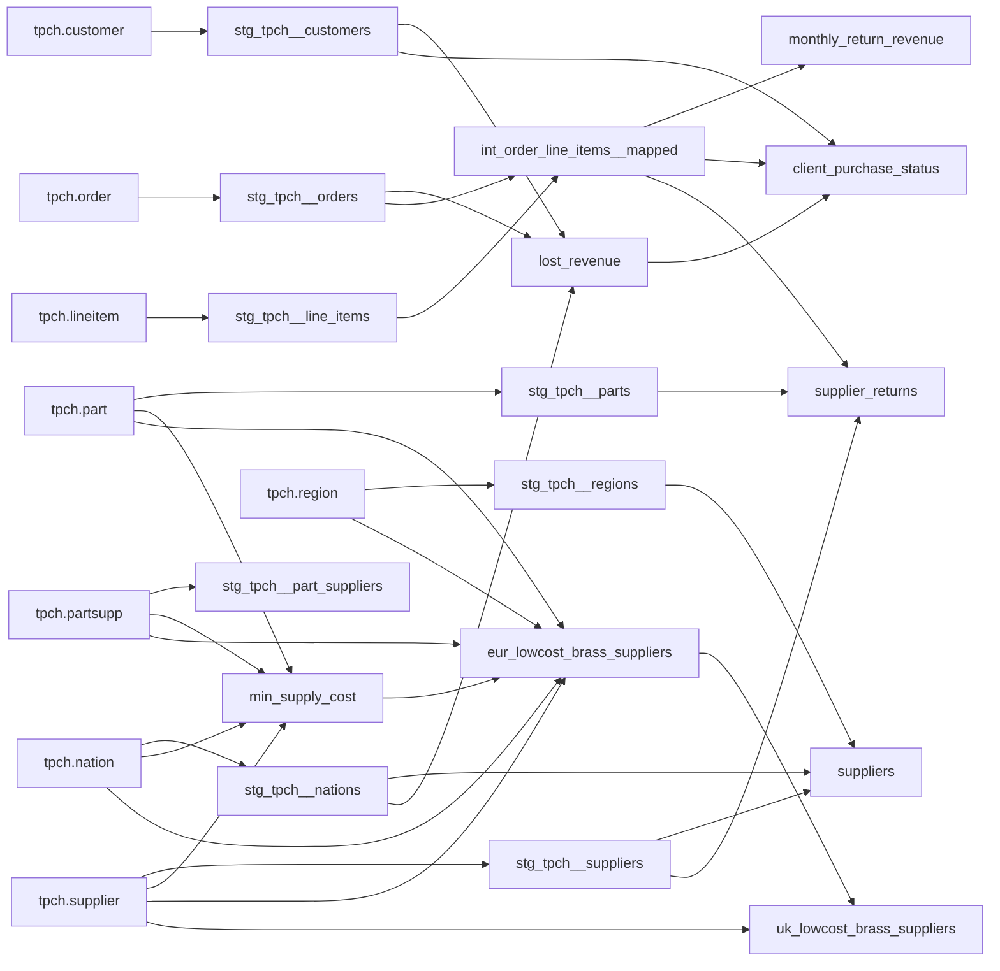

# Technical Assessment


This is a generic dbt project that can be used to evaluate data modeling
and other technical skills at a high level. Based on TPC-H data, this project
leverages TPC-H data to create a platform for exploring how a candidate thinks
about data transformation, analyzes and weights technical approaches, and
communicates feedback.

## TPC-H Source Data Structures



## dbt Project DAG

This is the current state of the dbt project's DAG. Generally. the project follows
[dbt Labs' recommended project structure guidelines][dbt labs structure], with some inherrited
structures that require maintainence.



# Development

To get started developing in this project, please make sure that you have the
following dependencies installed:

## duckdb

An embedded columnar database that can be used for lightweight analytics queries.
This project leverages duckdb as our datastore.

Can be installed via homebrew

```console
brew install duckdb
```

or via https://duckdb.org/docs/installation/.

## dbt-duckdb

The `dbt-duckdb` package is an adapter that allows dbt to leverage duckdb as
a datastore. It can be installed via pip

```console
pip install dbt-duckdb
```


## Using the project
Once your dependencies have been installed, you can use all of your standard
dbt commands for building, testing, and compiling your project.

For example, here's the command to build the project.
```console
dbt build
```

[dbt labs structure]: https://docs.getdbt.com/guides/best-practices/how-we-structure/1-guide-overview
